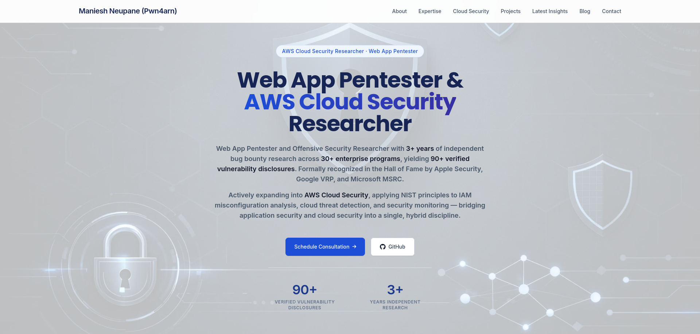
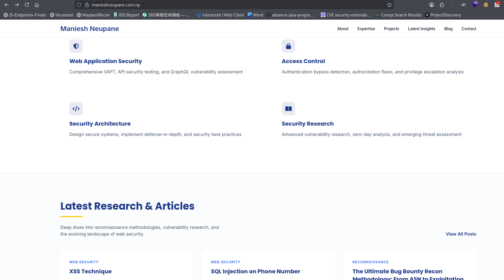

# Maniesh Neupane - Professional Security Portfolio

[Visit Live Site](https://manieshneupane.com.np/)

Professional portfolio showcasing Web Application Penetration Testing methodologies, Bug Bounty research, and cybersecurity insights.

---

## 🖥️ Project Previews

### Home Overview

### Expertise & Methodology

### Security Blog

---

## 🛠️ Tech Stack
* **Frontend:** Tailwind CSS, HTML5, GSAP
* **Security Frameworks:** OWASP Top 10, NIST, MITRE ATT&CK
* **Research Focus:** Reconnaissance, API Security, Access Control

© 2026 Maniesh Neupane
